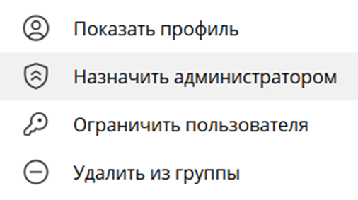
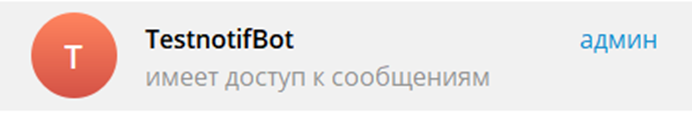
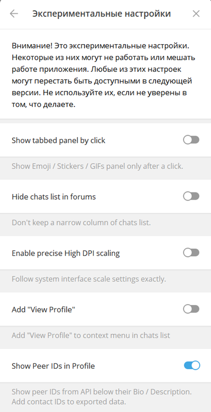
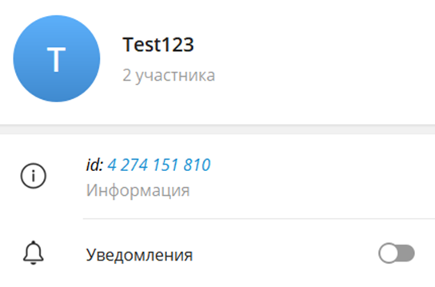

# Telegram Notification Bot

Библиотека для простой интеграции отправки сообщений, фотографий и документов в групповые чаты Telegram.
Обёртка над Aiogram 2.25.2.

_При рассылке в групповой чат не нужно следить за жизненным циклом бота
и не нужна стратегия хранения пользователей._

## Поддерживаемые версии


## Инструкция по интеграции

### Шаг 1: Создание Telegram-бота

1. Откройте Telegram и найдите бота **@BotFather**.
2. Отправьте команду `/start` для начала работы с @BotFather.
3. Отправьте `/newbot` для создания нового бота.
4. Следуйте инструкциям @BotFather:
  - Введите имя для бота.
  - Введите уникальное имя пользователя для бота, оканчивающееся на `bot` (например, `MyProjectBot`).

После создания бота @BotFather предоставит вам токен доступа. Сохраните этот токен для дальнейшей настройки.

### Шаг 2: Получение учетных данных

Ваш токен доступа будет выглядеть примерно так:

```
123456789:ABCdefGHIjklMNOpqrstuvWXYz
```

Этот токен позволит вашему приложению взаимодействовать с Telegram API.

### Шаг 3: Создание группы и добавление бота

1. Создайте новую группу в Telegram.
2. Добавьте созданного бота в группу как участника.
3. Назначьте боту права администратора:




_Если всё прошло успешно, в списке участников группы будет отображаться_ "**Имеет доступ к сообщениям**".



### Шаг 4: Получение ID группы

Существует два способа получить ID группы:

1. **В Telegram Desktop**: Включите экспериментальную функцию "Show Peer IDs in Profile":





2. **С помощью @username_to_id_bot**: Отправьте этому боту имя пользователя или ссылку на группу, и он вернёт её ID.

**Важно**: Telegram хранит ID групп и каналов по-разному: ID групп могут начинаться с "-" в начале,
а каналы с "-100".
Библиотека обрабатывает оба варианта хранения ID.

### Шаг 5: Установка библиотеки

Установите библиотеку с помощью pip:

```bash
pip install --use-deprecated=legacy-resolver --index-url=https://pypi-server.cism-ms.ru/ tg_notification_bot
```

### Шаг 5:Базовый интерфейс и контракты

## Использование

Использование

1. Импортируйте класс TgNotificationBot из библиотеки:
   from tg_notification_bot import TgNotificationBot
2. Создайте экземпляр TgNotificationBot, передав токен вашего Telegram бота и идентификатор группового чата:
   bot = TgNotificationBot(token="YOUR_BOT_TOKEN", chat_id="-123456789")
3. Используйте методы класса для отправки контента в групповой чат:

```python
# Отправка текстового сообщения
from app import bot

await bot.send_message("Привет, группа!")
```

```python
# Отправка фотографии
from app import bot

photo_path = r"C:\Users\SomeUser\Downloads\photo_2024-14-14_19-02-21.jpg"
await bot.send_photo(open(photo_path, "rb"), caption="Вот ваше фото!")
```

```python
# Отправка документа
from app import bot

document_path = r"C:\Users\SomeUser\Downloads\document.pdf"
await bot.send_document(open(document_path, "rb"), caption="Описание документа")
```
**Важно:** Telegram ограничивает размер документов до 50 МБ, а фото - до 10 МБ.
Чтобы отправить файл большего размера, разбейте его на несколько частей и выполните несколько запросов.

## Интеграция с FastAPI

Вы можете инициализировать экземпляр TgNotificationBot при запуске вашего приложения FastAPI
```python
from fastapi import FastAPI
from tg_notification_bot import TgNotificationBot

app = FastAPI()
bot = TgNotificationBot(token="YOUR_BOT_TOKEN", chat_id="-123456789")
```
Затем вы можете использовать экземпляр bot в своих маршрутах или обработчиках для отправки контента в групповой чат.

## Дополнительные возможности

Чтобы настроить отправку в несколько чатов или каналов, можно использовать несколько экземляров бота
```python
from fastapi import FastAPI
from tg_notification_bot import TgNotificationBot

app = FastAPI()
chat_bot = TgNotificationBot(token="YOUR_BOT_TOKEN", chat_id="-123456789")
channel_bot = TgNotificationBot(token="YOUR_BOT_TOKEN", chat_id="98765432")
```

Чтобы тегнуть пользователя по @username, можно отправить тег в тексте самого сообщения
```python
# Отправка текстового сообщения
from app import bot

user = "SomeUser"
await bot.send_message(f"Привет, @{user}!")
```

По умолчанию используется HTML разметка. Если нужна [MarkdownV2](https://core.telegram.org/bots/api#formatting-options), можно указать аргумент parse_mode:
```python
from app import bot

# Жирный текст
await bot.send_message("*Важное сообщение*", parse_mode="MarkdownV2")

# Курсив
await bot.send_message("_Это текст курсивом_", parse_mode="MarkdownV2")

# Монospace (код)
await bot.send_message("`print('Hello, World!')`", parse_mode="MarkdownV2")

# Ссылки
await bot.send_message("[Ссылка на Yandex](https://www.ya.ru)", parse_mode="MarkdownV2")

# Списки
await bot.send_message(
    "Список задач:\n"
    "- Задача 1\n"
    "- Задача 2\n"
    "- Задача 3",
    parse_mode="MarkdownV2"
)
```
